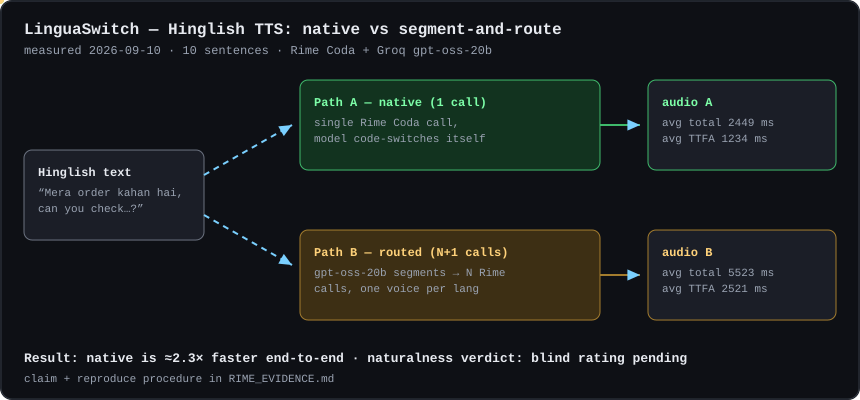
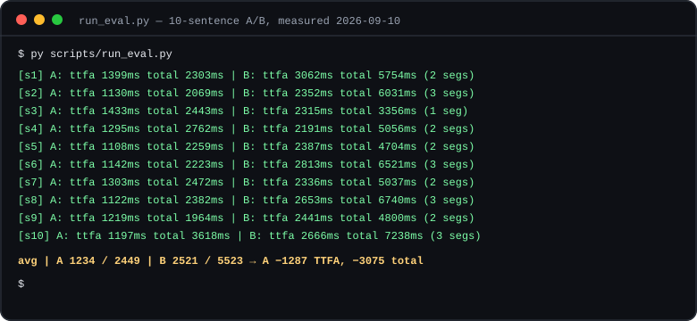
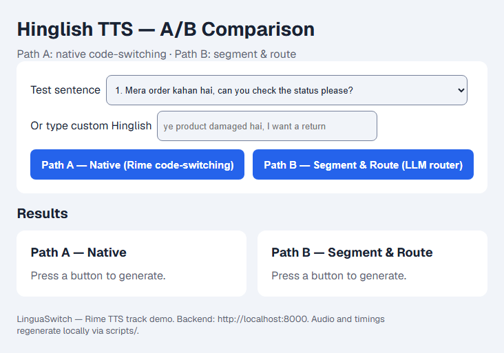
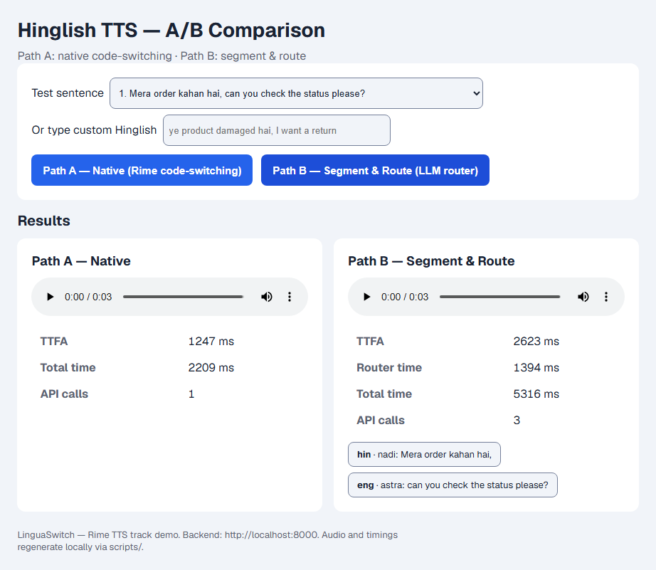

# LinguaSwitch — does native code-switching beat segment-and-route for Hinglish voice?


> **30-second pitch:** Indians talk to voice assistants in Hinglish — Hindi and English *inside one sentence*. Most TTS pipelines either force one language or swap voices mid-sentence and stitch the audio. LinguaSwitch tests the alternative: one native code-switched call (Rime Coda) against the stitch-together baseline, on the same 10 sentences, with blind human ratings and measured latency. **Result so far: native is ≈2.3× faster end-to-end; live blind-vote collection is wired into `/demo`, ratings still being collected.**



## A vs B on the same 10 sentences

| | Path A — native | Path B — segment-and-route |
|---|---|---|
| What happens | 1 Rime Coda call, model code-switches itself | Groq LLM tags `hin`/`eng` runs → 1 Rime call per run (own voice each) → WAV concat |
| API calls / sentence | 1 | segments + 1 router call (avg 3.3) |
| Avg TTFA | **1234 ms** | 2521 ms |
| Avg total | **2449 ms** | 5523 ms |
| Wins (of 10, latency) | **10** | 0 |



*Both SVGs are rendered from real measured output (`data/timings.jsonl`, 2026-09-10) — no mock numbers anywhere in this repo.*

## The demo UI (real captures)

`/demo`: pick a sentence (or type your own Hinglish, or save a custom sentence set), fire each path or **run both as a fair race**, play both, compare latency bars side by side. Blind X/Y mode hides the labels for unbiased listening, run history persists per browser with CSV export, and streaming playback + the LangGraph agentic panel run from the same page. `/eval` shows the rollup dashboard from `data/timings.jsonl`.

| Before — idle | After — both paths generated |
|---|---|
|  |  |
| "Press a button to generate." | Live run: A = 1 call / 2209 ms total · B = 3 calls / 5316 ms total, per-language speakers shown as tags |

*Captured with headless Chromium against the live backend + frontend. Numbers vary run to run with network; the direction (A faster, fewer calls) held on all 10 eval sentences.*

## How it works (request flow)

1. **Input** — preset sentence from `sentences.json` or free text. No STT: the research question lives on the output side.
2. **Path A (native)** — `rime.speak(text, "hin")`: one `POST /v1/rime-tts` (`modelId: coda`, voice `nadi`). Rime code-switches internally.
3. **Path B (baseline)** — `segmenter` (Groq `gpt-oss-20b`, few-shot JSON) splits the text into `hin`/`eng` runs → one Rime call per run, swapping voice per language (`nadi`/`astra` — a Rime voice serves exactly one language, so the voice swap is structural) → stdlib-`wave` concat. Rime streams placeholder WAV headers (`nframes=INT32_MAX`); `audio.py` rebuilds clean headers from actual bytes. Per-segment calls run **sequential by default** (published eval numbers stay comparable); pass `parallel: true` to fan out via `ThreadPoolExecutor` with honest wall-clock totals.
4. **Compare** — TTFA/total/API-calls per path, audio players side by side, segment tags showing router decisions. Live blind votes go to `POST /api/ratings/vote` and aggregate at `/api/ratings/tally`.

## Repo map

```
backend/        FastAPI: rime.py (sole Rime call site), segmenter.py (Groq router),
                audio.py (WAV concat), routes.py (speak/sentences/sets/cache),
                parallel.py (opt-in fan-out), cache.py (TTL, bypassed by eval),
                ratings.py + ratings_routes.py (blind-vote API),
                eval_routes.py (timings rollup), metrics_routes.py (seam proxy,
                request stats), mock_tts.py (MOCK_TTS offline mode),
                sentence_sets.py (custom lists), agent_graph.py (LangGraph agent),
                agent_routes.py, streaming.py (WS /ws3 bridge),
                config.py (env, single source of truth)
frontend/       Next.js: / (landing) · /demo (A/B lab: race, bars, blind mode,
                history, streaming, agentic panel) · /eval (dashboard)
scripts/        smoke_test.py (Day 0 gate) · run_eval.py (A/B + timings.jsonl,
                bypasses cache) · make_rater_packet.py (blind X/Y packets) ·
                bonus_segmentation.py · sbds.py (seam metric, librosa) ·
                export_summary.py (timings → summary.json + markdown table)
tests/          64 offline pytest cases (audio, routes, segmenter, mock, seam, API)
sentences.json  10-sentence test set (customer-support/everyday, 1–3 switches each)
Dockerfile + docker-compose.yml + frontend/Dockerfile  offline-capable dev stack
assets/         architecture.svg · terminal.svg · ui-idle.png · ui-results.png
RIME_EVIDENCE.md  falsifiable claim + acceptance test + measured tables
```

## Verification log (this machine)

| Check | Result |
|---|---|
| `smoke_test.py` (Rime eng/hin/mixed) | 3/3 valid WAV, TTFA ~1.1–1.4 s |
| Groq router probe (`gpt-oss-20b`) | correct `hin`/`eng` split, ~1.5 s |
| `run_eval.py` full 10-sentence A/B | 10/10 both paths (after fixing placeholder-header concat bug) |
| `pytest tests/` | **64 passed** (audio, routes, segmenter, mock, seam, API — offline) |
| `audio.py` self-check | pass (incl. placeholder-header regression case) |
| `tsc --noEmit` (frontend) | pass |
| Live app import, 16 routes | pass (`/api/health`, speak ×3, sentences, sets, cache, ratings, eval, metrics, seam) |
| `sbds.py` without librosa | clean "not installed" message, exit 1 |
| GitHub CI (pytest + tsc + build) | green on `main` |

## Test sentence set

Mix of customer-support and everyday phrasing, each with ≥1 mid-sentence switch; #10 is the 3-switch stress case. Full texts in `sentences.json`; `ground_truth` hand-labels (segmentation answer key) are filled by the team before running `bonus_segmentation.py`.

## Roadmap to submission

- [x] Provider access + corrected API shapes (Coda, `/v1/rime-tts`, current Groq IDs)
- [x] Both paths + eval harness + measured latency (A wins 10/10)
- [x] Live blind-vote collection (`/api/ratings/vote` + tally, wired into `/demo`)
- [x] Offline/mock mode + Docker + 64-test suite + CI
- [ ] Hand-label `ground_truth` (0/10 so far — native-speaker task, blocks the bonus table)
- [ ] Collect the actual blind ratings from 3–5 Hindi/English speakers
- [ ] `pip install librosa` → SBDS seam numbers → `RIME_EVIDENCE.md`
- [ ] Record 4–5 min demo (script outline in the original plan: problem → native → baseline → stress → numbers → provider disclosure)

## Quickstart (3 steps)

```bash
pip install -r requirements.txt
copy .env.example .env   # fill in RIME_API_KEY + GROQ_API_KEY
py scripts/smoke_test.py # Day 0 gate: confirms model/voices/endpoint live
```

```bash
py scripts/run_eval.py            # A/B latency + clips -> data/
py scripts/make_rater_packet.py   # blind packet -> rater_packet/
```

```bash
uvicorn backend.main:app --port 8000   # terminal 1
cd frontend && npm install && npm run dev   # terminal 2 -> http://localhost:3000
```

No keys? Run the offline stack instead (deterministic mock TTS + router, no billing):

```bash
MOCK_TTS=1 MOCK_SEGMENTER=1 uvicorn backend.main:app --port 8000
docker compose up   # backend + frontend, mock flags on, ./data persisted
```

## Claim under test

> Rime's native code-switching (single unified-model call) renders mid-sentence Hinglish more naturally, **and** no slower, than segment-and-route.

"Better" = blind-rater majority **plus** mean total time ≤ baseline. If either fails, the claim is false — see [`RIME_EVIDENCE.md`](RIME_EVIDENCE.md) for the acceptance test, method, measured latency table, and limitations. Naturalness ratings are still open (packets built by `make_rater_packet.py`).

<details>
<summary><strong>Pinned providers & values (verified live 2026-09-10)</strong></summary>

| What | Value |
|---|---|
| TTS model | Rime `coda` (Arcana is gone from the public catalog) |
| Path A voice | `nadi` (Coda Hindi voice) |
| Path B voices | Hindi runs → `nadi`, English runs → `astra` (one voice per language — structural) |
| Lang codes | `hin` / `eng` |
| Endpoint | `POST https://users.rime.ai/v1/rime-tts`, fields `text`/`speaker`/`modelId`/`lang`, `Accept: audio/wav` |
| Transport | REST streamed (eval); WebSocket `/ws3` bridge at `/api/speak/stream` (demo) |
| Router | Groq `openai/gpt-oss-20b` (MoE — replaces long-dead `mixtral-8x7b-32768`) |
| Bonus comparison | Groq `openai/gpt-oss-120b` + optional OpenRouter `deepseek/deepseek-r1:free` |

</details>

<details>
<summary><strong>API contracts</strong></summary>

- `POST /api/speak/native {text}` → `{audio_b64, ttfa_ms, total_ms, api_calls: 1}`
- `POST /api/speak/baseline {text, router_model?, parallel?}` → `{audio_b64, segment_ms, ttfa_ms, total_ms, api_calls, mode, cached, segments: [{lang, text, speaker, ttfa_ms, total_ms}]}`
- `POST /api/speak/agentic {text}` → both paths via the LangGraph agent (`backend/agent_graph.py`)
- `WS /api/speak/stream` → server-side bridge to Rime `/ws3` (browsers can't set the auth header)
- `GET /api/sentences` → the 10-sentence test set; `GET/POST /api/sentences/sets[/{name}]` → custom user lists
- `POST /api/ratings/vote {rater, question, choice}` → `GET /api/ratings/tally` (live blind counts)
- `GET /api/eval/summary` → latest-row-per-sentence rollup of `timings.jsonl` (powers `/eval`)
- `POST /api/metrics/seam {audio_b64}` + `/api/metrics/seam/compare` → stdlib seam proxy, no librosa needed
- `GET /api/health`, `GET /api/metrics/requests`, `GET/POST /api/cache/*` → liveness, per-request logs, TTL-cache controls
- Errors: HTTP 502 `{error, provider, fallback: "none"}` — failures surface honestly, never faked.
- Honesty guards: `run_eval.py` bypasses the cache and defaults to sequential, so published numbers always reflect live calls; API responses report `"cached": true/false`; `MOCK_TTS` audio is synthetic and never eval data.

</details>

<details>
<summary><strong>Evidence bundle & reproduce</strong></summary>

- `sentences.json` — 10 Hinglish sentences (customer-support/everyday, 1–3 switches each)
- `data/timings.jsonl` — one row per path per run (gitignored, regenerate; latest row per sentence/path wins)
- `data/clips/s{id}_{a,b}.wav` — rendered audio (gitignored)
- `rater_packet/` — blind X/Y randomized pairs + `responses.csv` (gitignored key)
- `scripts/sbds.py` — objective seam metric (silence gaps, pitch jumps, spectral flux, energy steps; weights pre-registered in-file)
- Reproduce: `py scripts/smoke_test.py` → `py scripts/run_eval.py` → `py scripts/make_rater_packet.py` → collect ratings → `py scripts/bonus_segmentation.py`

</details>

## Known limitations

- **No speech-to-text input** — text in, audio out. Deliberate scope cut; STT is another provider and another failure mode.
- **No fallback TTS** — if Rime fails, the error surfaces. Silent substitution would invalidate the A/B.
- **Small sample** — 10 sentences, a handful of raters. Directional signal, not proof; reported as raw counts.
- **Sequential baseline by default** — Path B fans out only with `parallel: true`, and `run_eval.py` bypasses the TTL cache, so the published numbers reflect live sequential calls. Parallel mode is measured with honest wall-clock totals instead of summed segment times.
- Single provider account, single region, one session — network variance uncontrolled.

## AI-assistance disclosure

Claude Code (Anthropic) scaffolded project structure, provider clients, eval scripts, and docs drafts. Sub-agents built the LangGraph wrapper, the SBDS metric, and the WS bridge (all compile-checked, provider calls verified live after). Teammate PRs added hardening + offline pytest suite + CI, the A/B lab UI, mock/Docker offline mode, ratings + observability APIs, the eval dashboard, streaming playback, and custom sentence sets. The hypothesis, sentence set, ground-truth labels, and all measured results come from the team's own runs; raters are humans.
